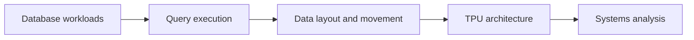

<h1 align="center">Xinyu Zhang</h1>

  
  
  

  <a href="https://www.linkedin.com/in/xinyu-zhang1">LinkedIn</a> ·
  <a href="mailto:zhangxinyu040326@163.com">Email</a> ·
  <a href="https://pubmed.ncbi.nlm.nih.gov/41282750/">Publication</a>

I'm an undergraduate at the University of Michigan studying Computer Science
and Mathematical Sciences, with a minor in Electrical Engineering. I am
interested in how database workloads map onto specialized hardware, from query
execution and data layout down to memory movement and accelerator architecture.

## `current focus`

- Studying database execution on Google Cloud TPU
- Understanding how query processing and data movement interact with
  accelerator architecture
- Building a low-level foundation through operating systems, concurrency, and
  processor design

## `selected work`

### [TPU-DB](https://github.com/samixyzdev/tpu-db)

Google-sponsored research at Michigan CSE on accelerating analytical database
queries with TPUs. I use JAX and Pallas to study query execution, data layout,
and the relationship between database operators and specialized hardware.

  

  Conceptual 4×4 matmul dataflow: activations move horizontally, weights
  move vertically, and processing elements accumulate in a diagonal
  wavefront.

This work is ongoing, so the public repository contains project context and
selected code rather than unpublished experimental results.

`Python` `JAX` `Pallas` `SQL` `Google Cloud TPU`

### [Language Model from Scratch](https://github.com/samixyzdev/A_language_model_from_scratch)

A from-scratch implementation of the core components behind a Transformer
language model. I implemented BPE training and tokenization, embeddings,
RMSNorm, SwiGLU, scaled dot-product attention, multi-head self-attention, RoPE,
and complete Transformer blocks, with unit tests against reference outputs.

The goal of this project was to understand each operation and tensor shape
directly instead of treating a high-level model implementation as a black box.

`Python` `PyTorch` `Transformers`

### Low-level systems

| Project | What I implemented |
| --- | --- |
| User-level thread library | Built preemptive scheduling across multiple CPUs, Mesa-style mutexes and condition variables, spinlocks, and timer/IPI handling |
| Multithreaded network file server | Implemented concurrent TCP request processing, hand-over-hand read-write locking, protocol validation, and crash-consistent disk updates |
| Virtual memory manager | Managed page faults, swap- and file-backed pages, Clock replacement, eager swap reservation, and copy-on-write fork |

### Computer architecture

Co-designed a two-way superscalar processor with a five-stage pipeline,
limited out-of-order issue, branch prediction, hazard resolution, and
multi-level forwarding. I verified the RTL against cycle-accurate memory traces
and synthesized it to a gate-level netlist under a 20 ns clock constraint.

`SystemVerilog` `VCS` `Verdi` `Synopsys Design Compiler`

## `publication`

Co-authored
[PANCDetect: Early Detection of Pancreatic Cancer from Multimodal EHR Data with LLM Embeddings](https://pubmed.ncbi.nlm.nih.gov/41282750/),
contributing to clinical data preprocessing and analysis for a multimodal
machine-learning study.

## `toolbox`

**Languages:** C, C++, Python, SQL, SystemVerilog 
**Systems:** Linux, multithreading, synchronization, networking, virtual memory 
**Performance:** profiling, benchmarking, memory-layout analysis, accelerator kernels

## `contact`

The easiest way to reach me is through
[LinkedIn](https://www.linkedin.com/in/xinyu-zhang1) or
[email](mailto:zhangxinyu040326@163.com).
